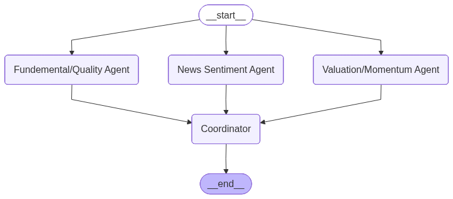

# MAAC: Multi-Agent Alpha Copilot

## Overview

MAAC (Multi-Agent Alpha Copilot) is a proof-of-concept AI system for financial analysis and investment recommendations. It orchestrates several specialized agents—each responsible for a distinct aspect of equity analysis (valuation/momentum, news sentiment, and fundamental quality)—and combines their outputs into a unified recommendation. The system also includes a backtesting module to evaluate the performance of its recommendations.

**Key Features:**
- Multi-agent architecture for stock analysis
- Integrates valuation/momentum, news sentiment, and fundamental analysis
- Uses Anthropic's Claude model for LLM-based reasoning
- Fetches real stock price, news, and financial data via API
- Backtests recommendations over a 3-month forward period
- Plots and logs performance metrics

## Requirements

- Tested on Ubuntu (WSL2 on Windows 11)
- Tested using Python 3.12
- API keys for [financialdatasets.ai](https://financialdatasets.ai/) and [Anthropic](https://www.anthropic.com/)
- See `requirements.txt` for all Python dependencies

## Installation

1. **Clone the repository:**
   ```bash
   git clone https://github.com/YorkshireGinger/MAAC.git
   cd MAAC
   ```

2. **Install dependencies:**
   ```bash
   pip install -r requirements.txt
   ```

3. **Setup & Initiate Virtual Environment**
    ```bash
    python3 -m venv venv
    source venv/bin/activate
    ```

3. **Set up environment variables:**
   - Copy `.env.example` to `.env` or create a `.env` file in the root directory.
   - Add your API keys:
     ```env
     FINANCIAL_DATASETS_API_KEY="<your-financialdatasets-api-key>"
     ANTHROPIC_API_KEY="<your-anthropic-api-key>"
     ANTHROPIC_MODEL="claude-sonnet-4-20250514"
     ```

## Usage

Run the main pipeline from the terminal within the initated venv:

```bash
python run.py --as_of_date YYYY-MM-DD
```
- `--as_of_date`: The analysis start date in `YYYY-MM-DD` format where BUY portfolio is constructed. Defaults to `2025-01-02` if not provided.

Example:
```bash
python run.py --as_of_date 2025-01-02
```

## What Happens When You Run It?
1. **MAAC Orchestration:**
   - The system analyzes a set of tickers (default: AAPL, MSFT, NVDA, TSLA) using three agents:
     - Valuation/Momentum (RSI)
     - News/Sentiment (VADER)
     - Fundamental/Quality (financial metrics)
   - Each agent fetches real data and produces recommendations.
   - The LLM (Anthropic Claude) coordinates and combines these into a final recommendation for each ticker.
   - The repo uses [LangGraph](https://langchain-ai.github.io/langgraph/tutorials/workflows/) to implement a router workflow.

    - The following diagram illustrates the MAAC workflow:

      

 
2. **Backtesting:**
   - The system simulates a 3-month forward period from the `as_of_date`.
   - It calculates and logs:
     - 3-month forward returns for MAAC "BUY" tickers vs all tickers
     - Annualized Sharpe ratios for both portfolios
     - Plots cumulative returns and saves the plot as `cumulative_returns_3m.png`

3. **Logging:**
   - All key steps and results are logged to the terminal for transparency.

## File Structure
- `run.py` — Main entry point for running the MAAC pipeline
- `graph.py` — Multi-agent orchestration and LLM logic
- `agents.py` — Agent tools for valuation, sentiment, and fundamentals
- `backtest.py` — Backtesting and performance evaluation
- `data/` — Data fetching utilities and news/sentiment analysis
- `requirements.txt` — Python dependencies
- `.env` — Environment variables (API keys)

## Notes
- The system is a proof-of-concept and will require further tuning for production use.
